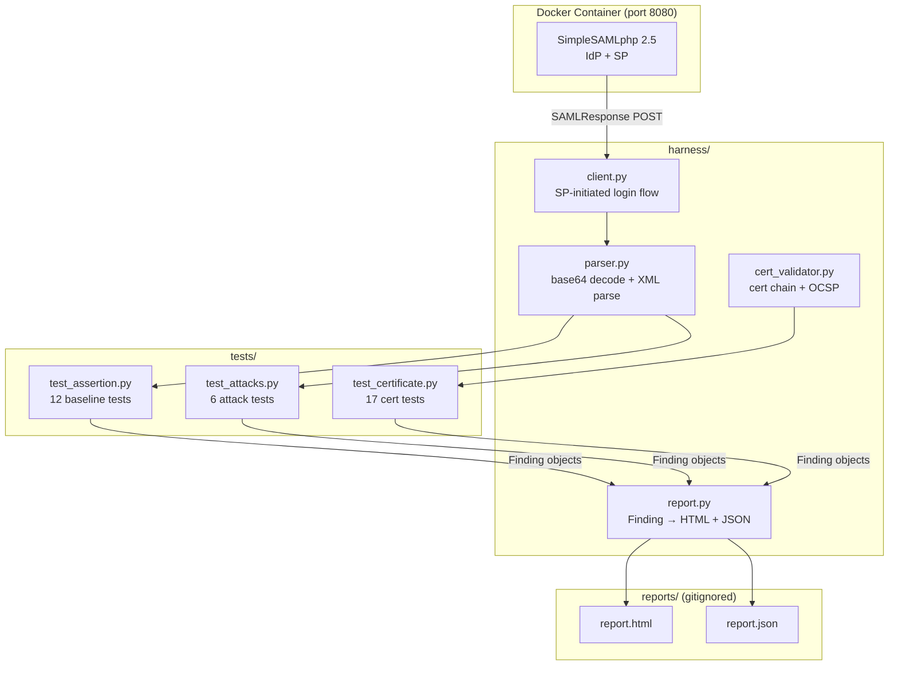

# SAML/SSO Security Test Harness

[](https://github.com/davidsonbr12/saml-security-harness/actions/workflows/saml_security.yml)

A security testing harness for SAML 2.0 Identity Providers. Simulates real attack vectors — XML Signature Wrapping, assertion replay, signature bypass, and more — against a local SimpleSAMLphp IdP running in Docker.

Built as a portfolio project for Security QA Engineering.

## Quickstart

```bash
git clone https://github.com/davidsonbr12/saml-security-harness.git && cd saml-security-harness
pip install -r requirements.txt
pytest -v
```

The test fixture starts and stops the Docker IdP automatically. Reports are written to `reports/` after every run.

## Project Phases

| Phase | Focus | Status |
|-------|-------|--------|
| 1 | Environment & Baseline — Docker IdP, baseline login + SAML structure tests | Complete |
| 2 | Certificate Validation Module — cert chain, expiry, hostname, OCSP | Complete |
| 3 | Attack Simulation Suite — XSW, replay, signature bypass | Complete |
| 4 | Reporting Layer — HTML + JSON findings output | Complete |
| 5 | CI/CD Pipeline — GitHub Actions, scheduled runs, badge | Complete |
| 6 | Polish & Documentation — README, architecture diagram, demo | Complete |

## Prerequisites

- Python 3.11+
- Docker (with Compose)

**Installing Docker by platform:**

| Platform | Steps |
|----------|-------|
| macOS | Install [Docker Desktop](https://www.docker.com/products/docker-desktop/) or `brew install docker docker-compose` |
| Windows | Install [Docker Desktop for Windows](https://www.docker.com/products/docker-desktop/) (includes Compose; enable WSL 2 backend when prompted) |
| Linux | Install [Docker Engine](https://docs.docker.com/engine/install/) then add the Compose plugin: `sudo apt install docker-compose-plugin` (Debian/Ubuntu) or `sudo dnf install docker-compose-plugin` (Fedora/RHEL). Add your user to the `docker` group to avoid `sudo`: `sudo usermod -aG docker $USER` (log out and back in after). |

**Docker Compose V1 vs V2:** Modern Docker ships Compose as a built-in plugin (`docker compose`). If you installed `docker-compose` (V1, standalone binary), both commands work — substitute `docker compose` for `docker-compose` in the commands below if your version requires it. Run `docker compose version` to check.

## Setup

```bash
# Clone the repo
git clone https://github.com/davidsonbr12/saml-security-harness.git
cd saml-security-harness

# Create and activate virtual environment
python3 -m venv .venv
source .venv/bin/activate        # macOS/Linux
# .venv\Scripts\activate         # Windows (Command Prompt)
# .venv\Scripts\Activate.ps1     # Windows (PowerShell)

# Install dependencies
pip install -r requirements.txt

# Build the Docker IdP image (required before first test run)
docker compose build
```

## Running Tests

```bash
# Run all tests (starts and stops the IdP container automatically)
pytest -v

# Run with stdout output visible
pytest -v -s

# Run only attack simulation tests
pytest -v -m attack

# Run only certificate validation tests (no Docker required)
pytest -v tests/test_certificate.py
```

The test fixture in `tests/conftest.py` manages the Docker container lifecycle — it starts the IdP before the session and tears it down after. If the container does not become ready within 60 seconds, the session fails with a clear error.

After every run, HTML and JSON reports are written to `reports/` (gitignored). Open `reports/report.html` in a browser to review findings by severity.

## Project Structure

```
saml-security-harness/
├── docker/
│   └── idp/
│       ├── Dockerfile          # Native ARM64 SimpleSAMLphp 2.5 image
│       ├── config/
│       │   ├── config.php      # SSP core configuration
│       │   └── authsources.php # Test user credentials
│       └── metadata/
│           ├── saml20-idp-hosted.php  # IdP metadata
│           ├── saml20-idp-remote.php  # IdP metadata as seen by the SP module
│           └── saml20-sp-remote.php   # Registered SP (real ACS endpoint)
├── harness/
│   ├── client.py          # HTTP session driver for SAML login flows
│   ├── parser.py          # SAML base64 decode and XML parsing
│   ├── cert_validator.py  # Certificate chain and expiry validation
│   └── report.py          # Severity-tagged HTML and JSON report generation
├── tests/
│   ├── conftest.py         # Docker fixture (session-scoped) + HTML/JSON reporting hooks
│   ├── test_assertion.py   # Phase 1: baseline login + SAML XML structure tests
│   ├── test_certificate.py # Phase 2: certificate chain, expiry, hostname, OCSP (17 tests)
│   └── test_attacks.py     # Phase 3: XSW, replay, signature bypass, audience, NameID
├── reports/            # HTML/JSON test reports (gitignored)
├── docker-compose.yml
├── pytest.ini
└── requirements.txt
```

## Attack Tests

| Test | Attack Vector | Expected Result |
|------|--------------|-----------------|
| `test_missing_signature` | SAMLResponse with all signatures stripped | SP rejects — signature required |
| `test_expired_conditions` | `NotOnOrAfter` set 1 hour in the past | SP rejects — assertion window closed |
| `test_audience_restriction_bypass` | `Audience` changed to attacker-controlled entity ID | SP rejects — wrong recipient |
| `test_name_id_injection` | SQL payload injected into `NameID` | SP rejects — signature broken by tamper |
| `test_replay_attack` | Same valid assertion submitted twice | **FINDING [HIGH]** — SSP default config does not enforce assertion ID replay protection |
| `test_xml_signature_wrapping` | Unsigned evil assertion inserted before the signed one | SP rejects — processes only the signed assertion |

The replay attack is marked `@pytest.mark.xfail(strict=True)` to document the open finding while keeping the suite green. It will flip to `XPASS` (and the suite will fail) if SSP ever enforces replay protection by default.

## IdP Test Credentials

| Username | Password |
|----------|----------|
| user1 | password1 |
| user2 | password2 |

Admin password: `testpassword`

The IdP runs at `http://localhost:8080/simplesaml` when the container is up.

## Architecture



## Report Interpretation Guide

After every `pytest` run, two reports are written to `reports/`:

**`report.html`** — open in any browser. Findings are sorted by severity and color-coded. Click any column header to re-sort. Use this for walkthroughs and internal review.

**`report.json`** — machine-readable. Suitable for ingestion into a SIEM, ticketing API, or CI step summary. Schema:

```json
{
  "generated_at": "<ISO 8601 timestamp>",
  "summary": {
    "total": 35,
    "by_severity": { "CRITICAL": 0, "HIGH": 1, "MEDIUM": 0, "LOW": 0, "INFO": 34 },
    "by_status":   { "PASS": 34, "FAIL": 0, "WARN": 1 }
  },
  "findings": [
    {
      "id": "<uuid>",
      "test_name": "tests/test_attacks.py::test_replay_attack",
      "severity": "HIGH",
      "status": "WARN",
      "detail": "...",
      "remediation": "..."
    }
  ]
}
```

**Severity levels:**

| Level | Meaning | Suggested SLA |
|-------|---------|---------------|
| CRITICAL | Authentication bypass possible | Fix before next deploy |
| HIGH | Security control missing or broken | Fix within 48 hours |
| MEDIUM | Security degraded but not bypassed | Fix within 2 weeks |
| LOW | Non-blocking configuration issue | Fix in next sprint |
| INFO | Observation, no action required | Track only |

**Statuses:**

| Status | Meaning |
|--------|---------|
| PASS | Test passed — defense held |
| FAIL | Test failed — unexpected result, investigate immediately |
| WARN | Expected finding (xfail) — documented open issue |

See [`docs/findings-summary-template.md`](docs/findings-summary-template.md) for a plain-English template to share findings with non-technical stakeholders.

## Architecture Notes

The Docker image uses `php:8.3-apache` as a native ARM64 base (required on Apple Silicon — pre-built SimpleSAMLphp images run under QEMU and fail with connection resets). SimpleSAMLphp 2.5 is installed via Composer at build time.

The container runs SimpleSAMLphp as **both IdP and SP** in the same instance. The `default-sp` authsource activates SSP's built-in SP module, which provides a real ACS endpoint for attack tests to POST against. This means attack tests submit tampered assertions to a genuine SAML validator — not a mock.

`session.cookie.secure` is disabled in the SSP config so that Python's `requests` library can send session cookies over HTTP during testing. In a production environment this would always be `true`.

The certificate validator (`harness/cert_validator.py`) enforces:
- **RFC 6125 §6.4.4** — when a SAN extension is present, CN is never used for hostname matching even if the SAN has no DNS entries
- **RFC 2818 §3.1** — wildcards require a multi-label suffix; `*.com` matching `b.com` is explicitly blocked
- **OCSP** — HTTP non-2xx responses from the responder produce a LOW finding rather than an unhandled exception

## Contributing

See [`CONTRIBUTING.md`](CONTRIBUTING.md) for instructions on adding new tests and the full finding schema reference.
